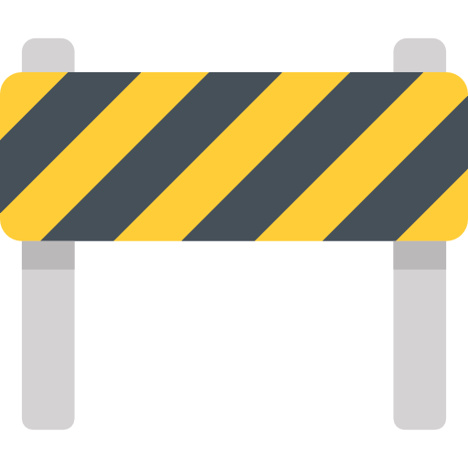

<h1>
    
    Construindo seu Portfólio Front-end do Zero
</h1>

Repositório desenvolvido durante a aula **Construindo seu Portfólio Front-end do Zero** da [Digital Innovation One](https://www.dio.me/) durante o Bootcamp Santander.

 

## Sobre
Bem-vindo(a) ao meu portfólio! Este repositório apresenta projetos, habilidades e experiências que representam minha trajetória de aprendizado como desenvolvedora e entusiasta de tecnologia. Ele foi desenvolvido com o objetivo de reunir meus projetos e apresentar um pouco sobre mim de forma clara, moderna e responsiva. 

## Tecnologias

 

## Contato
Email: nubia.mary.82@gmail.com 

Linkedin: https://www.linkedin.com/in/n%C3%BAbia-almeida-b9b51a184/
 
 ** Em Desenvolvimento ** 

Esse portfólio está em constante construção e evolução, para demonstrar o aprimoramento do aprendizado.

